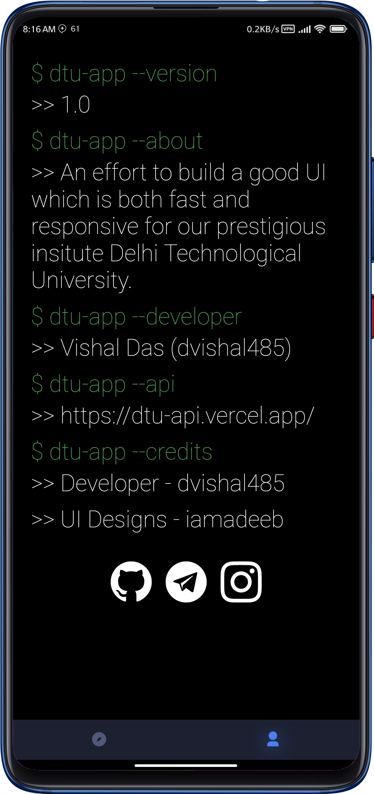
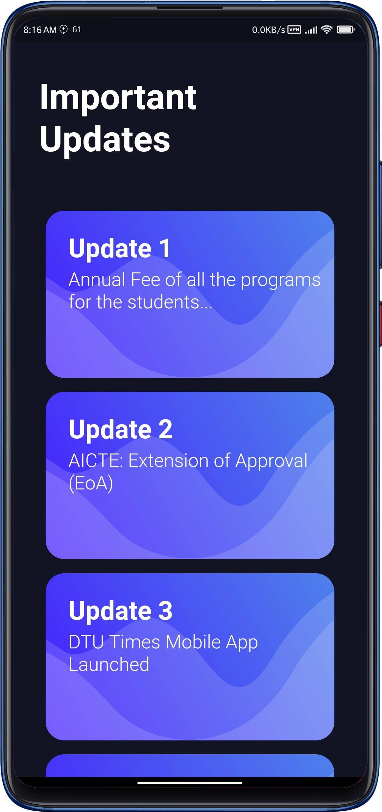
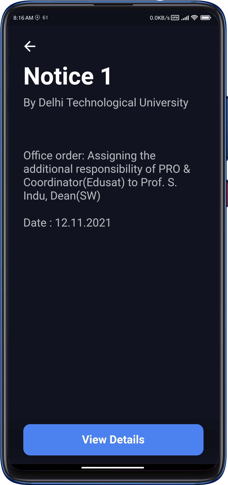

# DTU-App

Fast, responsive and good looking Delhi Technological University unofficial website client app

[🙌 Download the app from here](https://github.com/dvishal485/DTU-App/releases/latest)

---

## Introduction

The app has a vision to provide a material, good looking User Interface which can actually be used as an official app complimentary to the [the official website](http://dtu.ac.in/) of prestigious institute [Delhi Technological University](https://en.wikipedia.org/wiki/Delhi_Technological_University)

  &nbsp;&nbsp;&nbsp;&nbsp;
  &nbsp;&nbsp;&nbsp;&nbsp;
  &nbsp;&nbsp;&nbsp;&nbsp;
  

Fast, responsive and good looking is what one will expect from such a reputed university, and this app has been developed keeping the same in mind.

---

### Note

The <a href="https://dtu-api.vercel.app/">DTU-API referenced above</a> is also written and deployed by me on Vercel. Cheers to Vercel for being awesome!

---

## Credits
<ul>
    <li>API & Functioning - <a href="https://github.com/dvishal485">Me (dvishal485)</a></li>
    <li>Initial UI design - <a href="https://github.com/iamadeeb/Flutter-Meditation-App/commit/874683fff3ba3055743ce4e73618a96ce9ec50e7">iamadeeb</a></li>
    <li>API Hosting Service - <a href="https://vercel.com">Vercel</a></li>
</ul>

---

## License & Copyright

  - This Project is [Apache-2.0](./LICENSE) Licensed
  - Copyright 2021 [Vishal Das](https://github.com/dvishal485)
