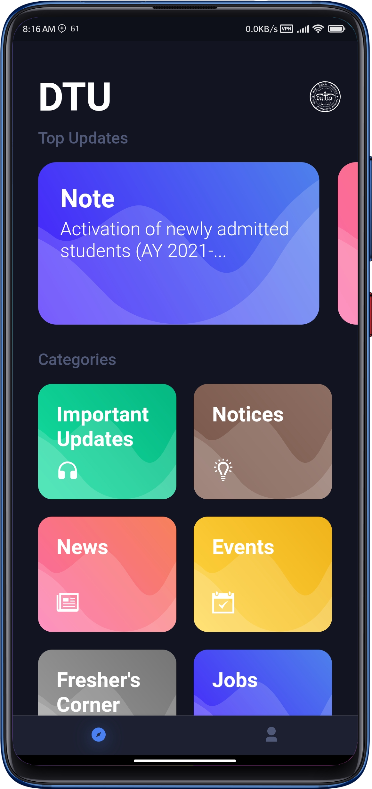

# DTU-App

Fast, responsive and good looking Delhi Technological University unofficial website client app

[🙌 Download the app from here](https://github.com/dvishal485/DTU-App/releases/tag/v1.0)

---

## Introduction

Apparently [the official website](http://dtu.ac.in/) of prestigious institute [Delhi Technological University](https://en.wikipedia.org/wiki/Delhi_Technological_University) is currently poorly optimized, as a result of which it takes a lot of memory and as well as time to open up. This app was created to resolve this issue with the medium of mobile app and provide a material, good looking User Interface which can actually be used as an official app complimentary to the institute's website.

  &nbsp;&nbsp;&nbsp;&nbsp;
  &nbsp;&nbsp;&nbsp;&nbsp;
  &nbsp;&nbsp;&nbsp;&nbsp;
  

Fast, responsive and good looking is what one will expect from such a reputed university, and this app has been developed keeping the same in mind.

---

## Working

The app fetches the lastest data avaliable on the website and display it accordingly ultimately giving the raw data a cleaner look. The working can be classified into majorly three parts :
<ol>
    <li>App Launch - Clears any previous data from last session</li>
    <li>Fetch Data - Fetch data of <a href="http://dtu.ac.in/">DTU's Official Website</a> using <a href="https://dtu-api.vercel.app/api">DTU-API</a> and store it locally</li>
    <li>Data Display - Once saved locally, all requests are made through the locally stored data saving memory and internet</li>
</ol>

### Note

The <a href="https://dtu-api.vercel.app/api">DTU-API referenced above</a> is also written and deployed by me on Vercel. Cheers to Vercel for being awesome!

---

## Credits
<ul>
    <li>API & Functioning - <a href="https://github.com/dvishal485">Me (dvishal485)</a></li>
    <li>Initial UI design - <a href="https://github.com/iamadeeb/Flutter-Meditation-App/commit/874683fff3ba3055743ce4e73618a96ce9ec50e7">iamadeeb</a></li>
    <li>API Hosting Service - <a href="https://vercel.com">Vercel</a></li>
</ul>

---

## License & Copyright

  - This Project is [Apache-2.0](./LICENSE) Licensed
  - Copyright 2021 [Vishal Das](https://github.com/dvishal485)
